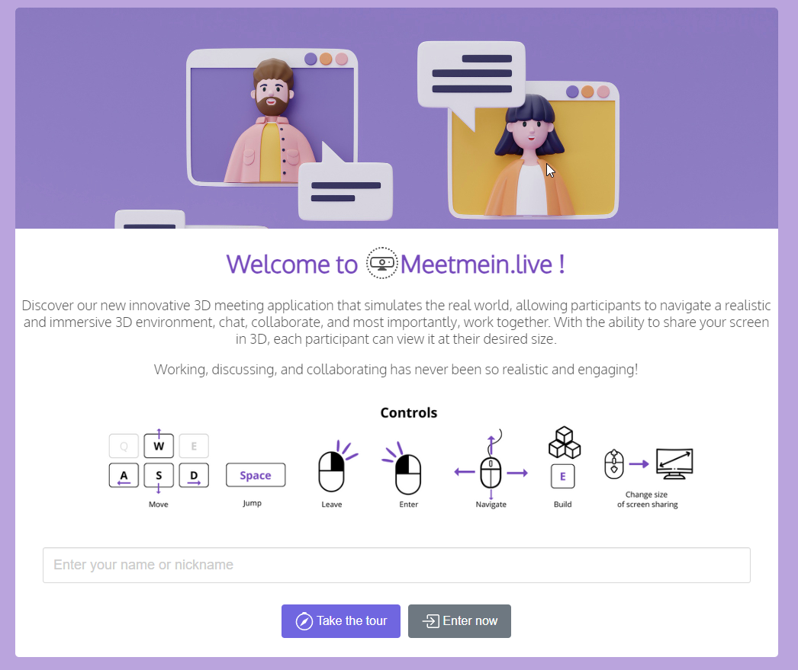

# meetmein.live

> Repository for the documentation, Support and contribution request for the > new immersive 3D meeting app MeetMeIn.live

Welcome to our innovative 3D meeting app repository! This application takes your virtual meetings to a whole new level by simulating the real world in a stunning 3D environment. Say goodbye to boring and static video conferences, and embrace a more immersive and engaging meeting experience.

## Features

- Realistic 3D World: Step into a virtual environment that closely resembles the real world. Experience realistic visuals and interactive elements that enhance your meeting experience.

- Seamless Navigation: Move freely within the 3D world using intuitive controls. Explore different rooms, interact with objects, and discover a dynamic meeting space.

- Collaborative Tools: Foster teamwork and collaboration with a range of innovative tools. Share screens, chat visualy and engage in real-time discussions with participants from around the globe.

- Advanced Communication: Communicate with crystal-clear audio and video. Experience seamless communication with participants using high-quality audio and video streaming technology.

## Contributions

We welcome contributions from the open-source community to enhance and improve our 3D meeting app. If you have any ideas, bug fixes, or feature suggestions, please submit a pull request. Together, let's make virtual meetings more immersive and enjoyable for everyone.

## Feedback and Support

Your feedback is invaluable to us! If you have any questions, feedback, or need support, please submit an [issue in github](https://github.com/michaelsazbon/meetmein.live/issues/new)
